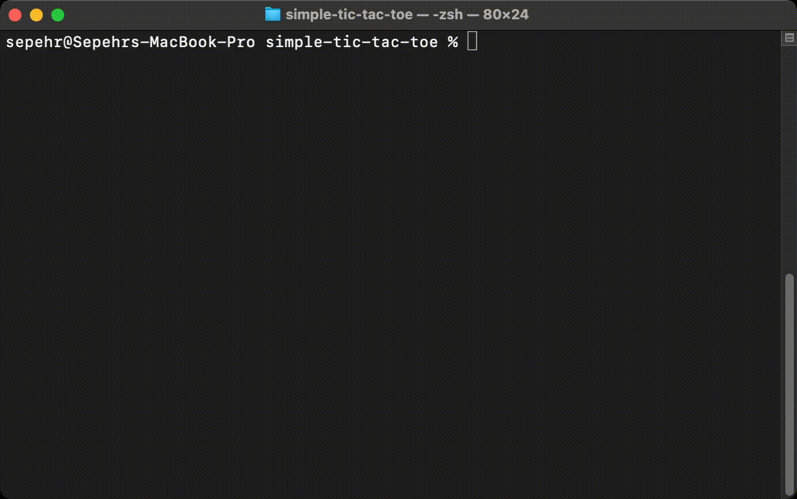
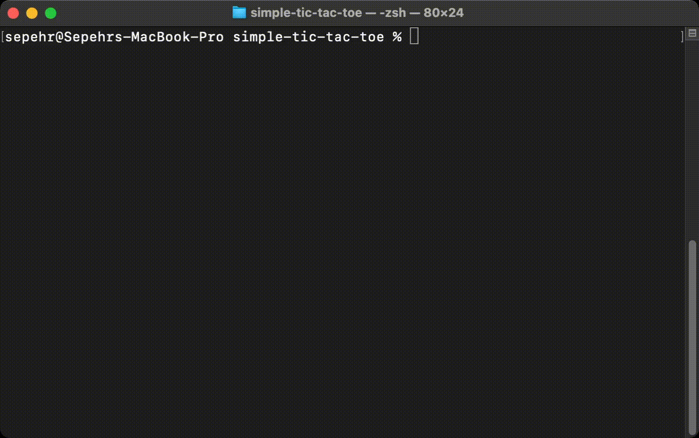

# Simple Tic-Tac-Toe

**Tic-tac-toe**  ([American English](https://en.wikipedia.org/wiki/American_English "American English")),  **noughts and crosses**  ([Commonwealth English](https://en.wikipedia.org/wiki/Commonwealth_English "Commonwealth English")  and  [British English](https://en.wikipedia.org/wiki/British_English "British English")), or  **Xs and Os**/“X’y O’sies” (Ireland), is a  [paper-and-pencil game](https://en.wikipedia.org/wiki/Paper-and-pencil_game "Paper-and-pencil game")  for two players,  _X_  and  _O_, who take turns marking the spaces in a 3×3 grid. The player who succeeds in placing three of their marks in a diagonal, horizontal, or vertical row is the winner. It is a  [solved game](https://en.wikipedia.org/wiki/Solved_game "Solved game")  with a forced draw assuming  [best play](https://en.wikipedia.org/wiki/Best_response "Best response")  from both players.

<div align="center">
  
  
</div>

## Table of Content

 - [Installation](#installation)
 - [Getting Started](#getting-started)
 - [Description](#description)
 - [References](#references)
 - [License](#license)

## Installation

In order to run the project, you should have at least one c++ compiler. If you are on the mac, I recommend you install the [gcc compiler](https://gcc.gnu.org/). For this purpose, you can easily type the following command in the terminal in order to check whether you have the g++ compiler on your computer or not.

```bash
g++
```

If you encounter the following message, it means you already have this compiler.

```bash
$ g++
clang: error: no input files
```

Otherwise, click `install` to start the installation process.

## Getting Started

First of all, you need to clone the project by following command.

```bash
git clone https://github.com/sprbpr/simple-tic-tac-toe.git
```

Then, with the command below, change your directory to project directory.

```bash
cd simple-tic-tac-toe
```

Next, compile the source code by the following command.

```bash
g++ TicTacToe.cpp -o play.out
```

Finally, by the following command, the game is started. Enjoy!

```bash
./play.out
```

## Description

The first thing you encounter at the beginning of the game is something like a menu. It asks you to select one of the following options:

- `p` to start the game.
- `r` to show the previous records.
- `q` to quit the game.

If you choose `p`, then the game asks the first player to choose their mark (x or o). Then in each step of the game, the player who has the turn should select the row and the column of the desired cell respectively, until one player wins the game or the game is tied.

If you choose `r`, then all the previous records which have been saved on `Records.txt` file are illustrated on the terminal.

Your last option is to quit the game. If you choose `q`, you easily exit the game without losing any previous records.


## References

Wikipedia contributors. (2021, August 13). Tic-tac-toe. In _Wikipedia, The Free Encyclopedia_. Retrieved 10:13, August 23, 2021, from [https://en.wikipedia.org/w/index.php?title=Tic-tac-toe&oldid=1038655777](https://en.wikipedia.org/w/index.php?title=Tic-tac-toe&oldid=1038655777)

## License
This project is licensed under the terms of the [MIT license](https://github.com/sprbpr/simple-tic-tac-toe/blob/main/LICENSE).